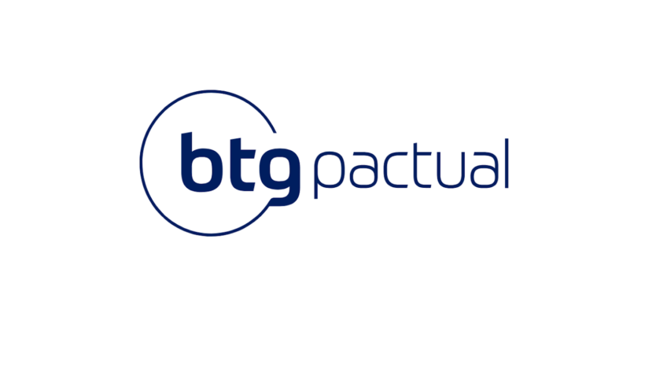

# Desafio Engenheiro de Software - BTG Pactual



Este repositório apresenta a solução desenvolvida para o desafio técnico do processo seletivo de Engenheiro de Software do BTG Pactual.

A proposta consiste em uma aplicação orientada a microsserviços capaz de processar pedidos recebidos por meio de uma fila RabbitMQ, armazenar as informações em um banco MongoDB e disponibilizar os dados processados por meio de uma API REST.

O sistema oferece funcionalidades para consultar:
- O valor total de um pedido.
- A quantidade de pedidos realizados por cliente.
- A lista completa de pedidos por cliente.

📄 [Link para enunciado do desafio](https://github.com/LeoAlves02/desafio-backend-btg-pactual/blob/main/enunciado.md)

---

## 🛠 Tecnologias Utilizadas

- **Java 21**
- **Spring Boot 3.3.4**
- **MongoDB**
- **RabbitMQ**
- **Docker / Docker Compose**
- **Postman** (para testes de API)
- **IntelliJ IDEA**
- **MongoDB Compass** (opcional, para visualização dos dados)

---

## 🚀 Como Executar o Projeto

> **Pré-requisitos:**  
> - Ter o **Docker** e **Docker Compose** instalados em sua máquina.

### Passo a passo:

1. Clone este repositório:

```bash
git clone https://github.com/LeoAlves02/desafio-backend-btg-pactual.git
cd desafio-backend-btg-pactual
```

2. Suba o ambiente completo com Docker Compose:

```bash
docker-compose up --build
```

3. Acesse os serviços:

- **API REST**: `http://localhost:8080`
- **RabbitMQ (painel de gerenciamento)**: `http://localhost:15672`  
  - Usuário: `guest`  
  - Senha: `guest`

4. Para testar a API, você pode utilizar ferramentas como **Postman**, **Insomnia** ou **curl**.

5. *(Opcional)* Para visualizar os dados do MongoDB, utilize o **MongoDB Compass**:  
   - Conexão padrão: `mongodb://localhost:27017`  
   - Banco utilizado: `btgpactualdb` *(ajuste conforme definido no projeto)*

---

## 📫 Endpoints da API

### 1. Lista de pedidos de um cliente (com paginação e total)

**GET** `/customers/{customerId}/orders`

**Parâmetros:**  
- `customerId` (path): ID do cliente.  
- `page` (query, opcional): número da página (padrão: 0).  
- `pageSize` (query, opcional): tamanho da página (padrão: 10).

**Retorno:**  
```json
{
  "meta": {
    "totalOnOrders": 150.0
  },
  "data": [
    {
      // dados do pedido
    }
  ],
  "pagination": {
    "page": 0,
    "pageSize": 10,
    "totalPages": 3,
    "totalElements": 25
  }
}
```
---

## Desafio inspirado no canal Build & Run

📄 [Repositório Build & Run](https://github.com/buildrun-tech/buildrun-desafio-backend-btg-pactual)
